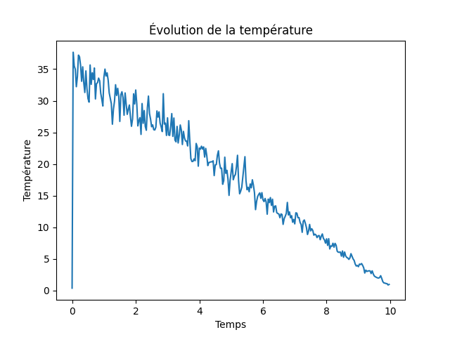

# 🌌 Particle Simulation  

A collection of **numerical simulations** modeling particle interactions using the **Verlet integration method**.  

This project explores:  
✔️ **Gravitational motion** (free-fall simulation)  
✔️ **Interacting particles with the Lennard-Jones potential**  
✔️ **Phase transitions using the Andersen thermostat**  

---

## 🚀 Project Overview  

### 1️⃣ **Free-Fall Simulation (Introduction to Verlet Integration)**  
- Simulates a **particle under gravity** using the Verlet algorithm.  
- Demonstrates the accuracy of **symplectic integration** over time.  
- **Visualized with Matplotlib animations**.  

### 2️⃣ **Lennard-Jones Potential (Particle Interactions)**  
- Models **interactions between particles** using the **Lennard-Jones potential**.  
- Simulates **attractive and repulsive forces** at different distances.  
- Used to study **molecular interactions** and **phase behavior**.  

### 3️⃣ **Phase Transition Simulation (Liquid-Solid Transition)**  
- Implements a **2D phase transition** from liquid to solid.  
- Uses the **Andersen thermostat** to control temperature.  
- Demonstrates the emergence of **crystalline structures** from disordered motion.  
- Result :   

---

## 🛠 Installation & Dependencies  

Ensure you have Python **3.7+** and install the required libraries:  

```bash
pip install numpy matplotlib
```

---

## 🚀 Usage

Run any of the simulations with:

```bash
python free-fall.py
python lennard-jones-potential.py
python transition de phase.py
```
Animations and results will be displayed automatically.

---

📂 Project Structure

📂 particle-simulation/

├── 📜 README.md (This file)

├── 🎥 free-fall.mp4 (Animation of a free-fall simulation)

├── 🎥 lennard-jones.mp4 (Particle interaction using Lennard-Jones potential)

├── 🎥 transition-de-phase.mp4 (Phase transition simulation output)

├── 📊 transition_de_phase-Temperature.png (Temperature evolution during phase transition)

├── 📝 free-fall.py (Gravitational simulation using Verlet method)

├── 📝 lennard-jones-potential.py (Simulation of Lennard-Jones interactions)

└── 📝 transition de phase.py (2D phase transition with Andersen thermostat)

---

## 🤝 Contributions & Contact

Contributions are welcome! You can:

- Fork the repository and improve the simulations.

- Submit a pull request for enhancements or bug fixes.

- Open an issue for discussions or questions.

📩 Feel free to reach out for any suggestions!

## 🚀 Happy simulating!
